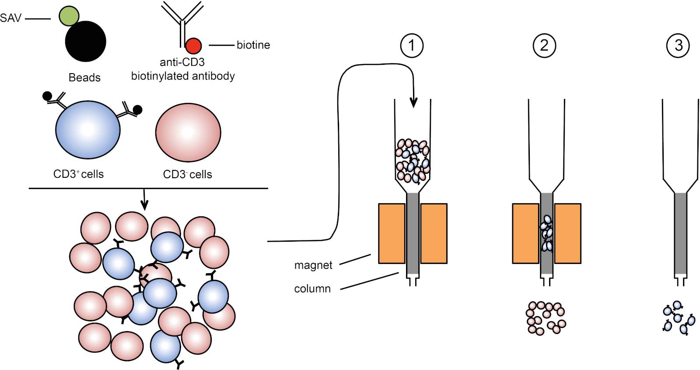
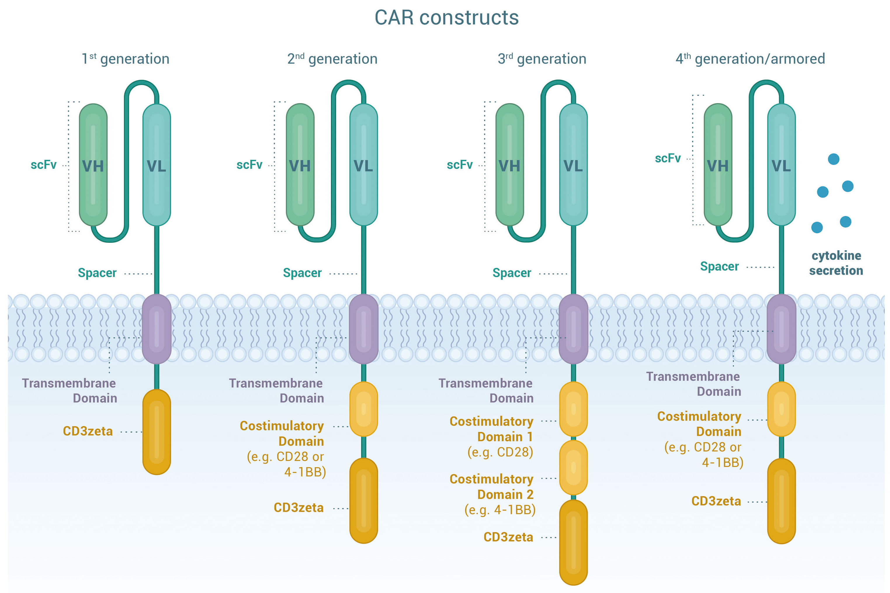

# CAR-T Cell Therapy For Autoimmune Diseases

[1. Overview](#Overview) 
[2. Steps](#Steps) 
[3. Antigens](#Antigens) 
[4. Clinical Papers for Autoimmune Diseases](#Clinical-Papers-for-Autoimmune-Diseases) 
[5. Dr. Lung-Ji Chang Paper Breakdown](#Dr-Lung-Ji-Chang-Paper-Breakdown)

## Overview

Chimeric antigen receptor T cell (CAR-T) therapy is a novel treatment for cancer, and more recently, autoimmunity. T cells of the adaptive immune system are engineered to give them the ability to target a particular antigen (a protein) of the body. The word “chimeric” is used since the engineered receptor has both antigen-binding and T cell activating functions. CAR-T therapy is generally a 6-step process: leukapheresis, T cell isolation, CAR gene transduction, CAR-T cell expansion, lymphodepletion, and infusion. 

    

Leukapheresis is the process of separating white blood cells (WBCs) from the blood of a patient. After this, T cells are isolated from the WBCs usually by CD3 magnetic beads. CD3 is a protein expressed on the surface of T cells and these beads are able to bind to CD3 allowing for the separation using a magnet.

    

The CAR construct is introduced into the isolated T cells by transfecting them with a retrovirus, typically a lentiviral vector. This viral vector contains the gene which encodes for the chimeric antigen receptor that the T cells utilize to recognize and attack their target. The vector is able to incorporate the gene into the genome of the T cell, which allows for expression of the CAR protein. When the CAR protein is made inside the T cell, it is then naturally brought to the surface of the cell so that it can interact with its target antigen.

The CAR protein itself needs to have at least 5 main components: the single-chain variable fragment (scFv), the hinge region, the transmembrane domain, a costimulatory domain, and the intracellular signaling domain. The scFv is the part of the protein that recognizes and binds to the specific antigen. The hinge region provides flexibility to the CAR protein, allowing it to move and bind to the antigen more efficiently. The transmembrane domain anchors the CAR protein to the surface of the T cell membrane. The co-stimulatory domain helps the T cell become activated when the scFv binds to its antigen, and there are several types, including CD28, 4-1BB, CD137, CD127, and OX40. This can impact the potency and durability of the CAR-T. There can also be multiple costimulatory domains as part of the CAR construct. Finally, the intracellular signaling domain, almost always CD3ζ, initiates the signaling cascade that makes the T cell ultimately activate and either kill its target or release cytokines. Over time, several generations of CAR constructs have been developed.

    

The transfected T cells containing the CAR gene are then expanded ex vivo. This is typically done by stimulating the CD3 and CD28 domains on the T cell, causing them to activate and proliferate while also exposing them to growth-promoting cytokines. These cytokines include IL-2, IL-7, and IL-15. 

Once enough T cells are expanded, they are infused back into the patient so that they can recognize and target the cells, typically B cells, for death. The CAR-T cells will bind to the cell and, either directly kill the cell via cytotoxic effects (like granzyme B), or release cytokines, recruiting other components of the patient’s immune system to effectively destroy them. This leads to the desired outcome of either a reduction in cancer or mitigation of autoimmune diseases, improving the patient's condition and quality of life.

## Steps

- Summary Papers
    - https://www.ncbi.nlm.nih.gov/pmc/articles/PMC4909095/
    - https://pubmed.ncbi.nlm.nih.gov/28652918/
    - https://www.cell.com/cancer-cell/fulltext/S1535-6108(20)30366-4

1. Leukapheresis - Separate white blood cells from blood of patient.
2. T cell isolation - Isolate T cells from WBCs using CD3 magnetic beads.
3. CAR gene transduction - Transfect T cells with retrovirus containing CAR gene.
4. CAR-T cell expansion - Stimulate T cells to proliferate and expand.
5. Lymphodepletion - Administer chemotherapy to deplete lymphocytes.
6. Infusion - Infuse CAR-T cells back into patient.

## Antigen Targets

B cell antigens:
- CD10
- CD19
- CD20
- CD22
- CD23
- CD30
- CD37
- CD52
- CD70
- CD79b
- CD123
- CD138
- ROR1 (Receptor tyrosine kinase-like orphan receptor 1)
- Light chain kappa/lambda

Plasma cell antigens:
- CD38
- CD56
- CD138
- CD229
- BCMA (B-cell maturation antigen)
- CS1
- FcRH5
- GPRC5D

T cell antigens:
- CD1a
- CD5
- CD7
- CD30
- TRBC1 (T-cell receptor beta constant 1)

Myeloid cell antigens:
- CD33
- CD38
- CD44
- CD70
- CD96
- CD117 (KIT)
- CD123
- CD135 (FLT3)
- Lewis Y antigen
- NKG2D ligands
- CLL-1 (C-type lectin-like molecule-1)
- TIM-3 (T-cell immunoglobulin and mucin-domain containing-3)
- PR1/HLA-A2 (Proteinase 3 or PR1 antigen)

## Clinical Papers for Autoimmune Diseases

**2022 - Nature Medicine   Anti-CD19 CAR T cell therapy for refractory systemic lupus erythematosus**   [Link](https://www.nature.com/articles/s41591-022-02017-5)

- Study type: Case series
- CAR construct: CAR19
    - Anti-CD19 ScFv-4-1BB-CD3ζ
- Disease: Systemic lupus erythematosus (SLE)
- Number of patients: 5
    - 4 female | 1 male
    - Ages 18-23
    - Stage III/IV lupus nephritis
    - Disease duration: 1-9 years
- Lymphodepletion: cyclophosphamide (1000mg/m2/d) on day -3 and fludarabine (30mg/m2/d) on days -5, -4, and -3
- CAR-T cell count: 1x10^6/kg
    - Peak expansion: 11.48% to 59.12% of CD3+ T cells
- Adverse events: 3 patients had grade 1 CRS (fever) which was resolved with metamizole (3 patients) and tocilizumab (1 patient)
- Outcome: complete drug-free remission in all 5 patients, no recurrence after 12 months

---

**2023 - The Lancet   CD19-targeted CAR T cells in refractory antisynthetase syndrome**   [Link](https://www.nature.com/articles/s41591-021-01387-0)

- Study type: Case report
- CAR construct: CAR19
    - Anti-CD19 ScFv-4-1BB-CD3ζ
- Disease: Antisynthetase syndrome
- Lymphodepletion: cyclophosphamide (1000mg/m2/d) on day -3 and fludarabine (30mg/m2/d) on days -5, -4, and -3
- CAR-T cell count: 1x10^6/kg
    - Peak expansion: 3.5% of CD3+ T cells
- Adverse events: grade 1 CRS (fever) which was resolved with paracetamol and tocilizumab
- Outcome: complete remission including resolution of myositis, interstitial lung disease, creatine kinase, and anti-Jo-1 antibodies
    - No follow-up for this patient reported

## Dr. Lung-Ji Chang Paper Breakdown

Dr. Chang is the President of the Shenzhen Geno-Immune Medical Institute and has been developing CAR-T therapies for cancer, and recently, has begun a clinical trial for using CAR-T therapy in autoimmune diseases (NCT05459870). The following is a breakdown and notes of all his papers related to CAR-T therapy (still in progress).

**2015 - Blood   First-in-man CD123-specific chimeric antigen receptor-modified T cells for the treatment of refractory acute myeloid leukemia**   [Link](https://ashpublications.org/blood/article/126/23/3778/93119/First-in-Man-CD123-Specific-Chimeric-Antigen)

- Study type: Clinical case report
- CAR construct: 4SCAR123
    - Anti-CD123 ScFv-CD28-CD137-CD27-CD3ζ-2A-iCasp9
    - Costimulatory molecules: CD28, CD137, and CD27
    - iCasp9 suicide gene
        - Giving Rimiducid (AP1903) rapidly induces CAR-T apoptosis
    - 2A is a peptide to allow CAR construct and iCasp9 to be expressed separately
- Cancer: Acute myeloid leukemia (AML) - 1 patient - 47-year old male - post allogeneic HSCT
- Lymphodepletion: cyclophosphamide 250mg/kg/day for 3 days (if 50kg - 37.5g total)
- CAR-T cell count: 1.8 x 106/kg (if 50kg - 9.0 x 107)
- Adverse events: Severe CRS on day 4, given Tocilizumab (anti-IL6) and controlled
- Outcome: Achieved partial remission after 20 days

---

**2019 - Frontiers in Oncology   CD19 and CD70 dual-target chimeric antigen receptor T-cell therapy for the treatment of relapsed and refractory primary central nervous system diffuse large B-Cell Lymphoma**   [Link](https://www.frontiersin.org/articles/10.3389/fonc.2019.01350/full)

- Study type: Clinical case report
- Dual CAR construct: 4SCAR19 and 4SCAR70
    - Anti-CD19/CD70 ScFv-CD28-CD27-CD3ζ-2A-iCasp9
- Cancer: Primary central nervous system diffuse large B cell lymphoma (PCNS-DLBCL) - 1 patient - 67-year old male - post 2-relapses
    - Concern for this patient due to central nervous system lymphoma and the potential for CART-related encephalopathy syndrome (neurotoxicity) - PCNSL patients are almost always excluded from receiving CAR-T therapy
    - Worth noting the patient achieved remission before CAR-T with 6 rituximab cycles, ibrutinib, and high-dose methotrexate altogether
- Lymphodepletion: cyclophosphamide 300mg/m2/d and fludarabine 30mg/m2/d (~1.5-2g and ~150-200mg total for 50kg person)
- CAR-T cell count: 1.0 x 108 anti-CD19 CAR-T cells and 8.2 x 107 anti-CD70 CAR-T cells total 
    - Both given on day 0 
    - Expansion of 4SCAR19 and 4SCAR70 was ~2.28% and ~0.48% respectively of PBMCs
- Adverse events: No CRS or neurotoxicity, only slight hematological toxicity
- Outcome: complete remission at 17 month follow up
- Both CAR-T cell types were detectable 321 days after infusion

---

**2018 - Oral Oncology   CD70 as a target for chimeric antigen receptor T cells in head and neck squamous cell carcinoma**   [Link](https://www.sciencedirect.com/science/article/abs/pii/S1368837518300344)

- Study type: Preclinical (in vitro)
- CAR construct: 4SCAR70
    - Anti-CD70 scFv-CD27-41BB-CD3ζ
- Cancer: Head and neck squamous cell carcinoma (HNSCC)
- First, the authors screened for CAR-T targets of HNSCC using expression data from the Cancer Genome Atlas (TCGA) and CD70 was selected for further analysis because of the availability of a CD70-binding CAR construct used in other studies
    - CD70 was overexpressed in HNSCC five times more compared to controls
- They found that CD70 was overexpressed in tumor tissues vs controls and posed a viable CAR-T target for HNSCC
- The authors used T cells from 3 donors to create anti-CD70 CAR-T cells and showed they were able to kill cell lines that overexpressed CD70 at different effector:target ratios
- Lastly, they concluded that since some TCGA data did not show differences in CD70 expression between cancer and controls, anti-CD70 CAR-T therapy is not suitable for every HNSCC case

---

**2020 - Frontiers in Immunology   Phase I Trial of Fourth-Generation Anti-CD19 Chimeric Antigen Receptor T Cells Against Relapsed or Refractory B Cell Non-Hodgkin Lymphomas**   [Link](https://www.frontiersin.org/articles/10.3389/fimmu.2020.564099/full)

- Study type: Phase I trial single-arm with <ins>**no comparator**</ins>
- CAR construct: 4SCAR19
    - Anti-CD19 scFv-CD28-CD27-CD3ζ-2A-iCasp9
- Cancer: refractory/relapsed B-cell non-Hodgkin’s lymphoma
- Patient characteristics:
    - n=21 - 13 male | 8 female
    - Ages 31 to 77
    - Stage II (n=1), stage III (n=5), stage 4 (n=15)
- Lymphodepletion: cyclophosphamide 900mg/m2 once and fludarabine 25mg/m2/d for 3d (~1.5-2g and ~125-150mg total for 50kg person)
- CAR-T cell count: median of 8.9 x 105/kg (if 50kg - 4.45 x 107)
    - 1:1 ratio of CD4+ and CD8+ T cells
    - CAR-T persistence correlated with patient response
    - CAR-T expansion DID NOT correlate with patient response
- Adverse events: 3 cases of CRS, 1 case of CRES
    - CRS was grade 1 in all 3 patients and resolved in 2-10 days
        - Interestingly these 3 patients did not respond to the treatment
    - CRES was grade 3 on day 33 - cognitive impairment, aphonia, unresponsiveness, mild irritability, and headache
        - Resolved after dexamethasone and saline
        - Lymphoma progressed 29 days after partial response to the CAR-T
- Outcome: 43% complete remission and 24% with partial response
    - First documented remission was 58 days post-infusion with some taking months
    - 5 patients remained in remission 5-20 months post-infusion
    - 7 patients relapsed or progressed without antigen escape
    - 7 patients died of relapse or disease progression by the study cutoff time (22 months)
